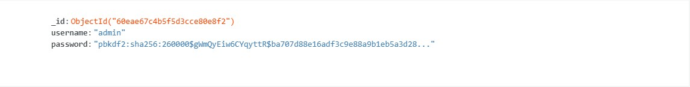
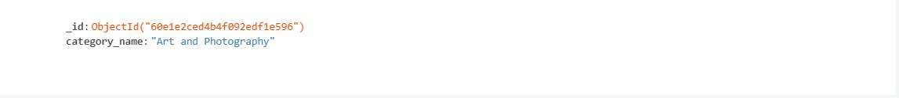
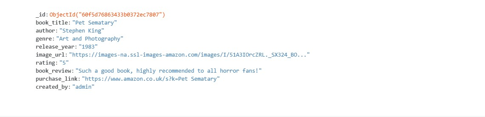
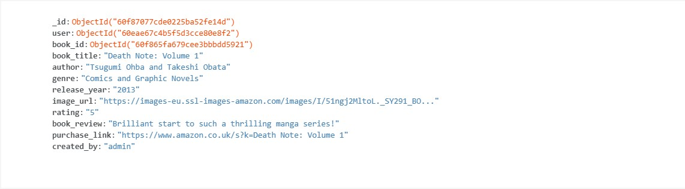

# Taylor Brookes - Milestone Project 3
## Read-It

[Visit my live website here!](https://read-it-ms3.herokuapp.com/)

![]image here(www.)

# Table Of Contents

1. [Overview](#overview)
2. [UX](#ux)
    - [Target Audience](#target-audience)
    - [User Stories](#user-stories)
3. [Design](#design)
    - [Wireframes](#wireframes)
    - [Typography](#typography)
    - [Colours](#colours)
    - [Database](#database)
4. [Features](#features)
    - [Current Features](#current-features)
    - [Future Features](#future-features)
5. [Technologies Used](#technologies-used)
    - [Languages](#languages)
    - [Database](#database)
    - [Frameworks Libraries and Programmes](#frameworks-libraries-and-programmes)
6. [Testing](#testing)
7. [Deployment](#deployment)
8. [Credits](#credits)

# Overview

Read-It is a site that is designed for people who are looking to keep a record of books that they have read, and share their reviews with others. 
Users are able to view books and reviews without needing to create an account. This allows new users to preview the site before registering so they have an idea of what the site is like. 
When a User decides to register, they will be able to log in with ease, create and manage their favourite books, and share them with other Users of the site. They will also be able to ‘bookmark’ books that they wish to read or want to keep tabs on.

[Back to contents](#table-of-contents)

# UX

## Target Audience

The target audience for my site is people who are avid readers. They’ll be able to keep a list of the books they have rated and reviewed, as well as view other people’s reviews. 

## User Stories

### First time and returning users

All users of this site will be looking for similar things, outlined below;
-	Easy and clear navigation throughout the entire site on all device types.
-	To be able to view/preview the site before registering an account.
-	Have clear Registration/Log In pages.
-	Have the ability to add their own reviews and keep a record of them.
-	To be able to edit and delete reviews posted.
-	Search the site to find other reviews.
-	For the review information to be clear and concise.
-   Keep a record of books they are interested in.
-	Find links where they can purchase the books.
-	To be provided with contact information and social links.
-	Once finished, to securely log out of the site.

### Site owner/admin

-	For users to have easy access to all areas of the site.
-	For the site to be clear and concise.
-	The ability for users to contact them for any feedback/issues surrounding the site.
-	To be able to add, edit and delete book reviews.
-	Have access to an admin account whereby the owner/admin can add affiliate links to each review left by a user, and earn money from those links. (For project purposes, these links will NOT be affiliate links, and will only be links to the books on Amazon.)

[Back to contents](#table-of-contents)

# Design

## Wireframes

To create the wireframes, I used Balsamiq. I started with the mobile wireframes and worked my way to a larger screen size. Below are the links to the completed wireframes;

-	[Mobile](static/images/wireframes/mobilewf.pdf)
-	[Desktop/Laptop](static/images/wireframes/desktopwf.pdf)

I kept the original ideas for the site as when I built it, I felt that everything worked well and I didn’t need to amend anything. 

## Typography

For this site I have used two fonts; the one auto assigned to Materialize, and one taken from Google Fonts:
-	Source Code Pro

I chose this as my main font for the site because I wanted a font related to books in some way, and the best sort of font would be that of a typewriter. A lot of typewriter style fonts however, have larger gaps in between each letter, but I found this particular font was spaced just as I wanted it to be. 

I also used Font Awesome to provide fun icons across my site, and for a more visually appealing look. 

## Colours

For the colour scheme for my site, I mainly used the Materialize colour chart. I wanted my site to be green as I personally like the colour.
Here is a list of colours used for my site;
-	Mintcream – Mintcream is used as the background colour of the site. I didn’t want a plain white background, but I also didn’t want a bright colour so this colour was perfect. It works well with all the other colours I have used, and provided a subtle green shade across the site.
-	#000000/Black – Black is used as a text colour when the background colour is white or a light shade of green. 
-	#ffffff/White – White is mostly used as the text colour when the background is a shade of green. It is also used as the background colour of the ‘cards’ on my site.
-	#00e676 – This is the main colour of my site, which when written in my html code as a class, is written as ‘green accent-4’. I wanted to use a bright green, but I didn’t want it to be too bright and appear neon as this would turn users away from the site. This is mainly used for the nav bar, footer, flash messages and all standard button colours. 
-	#4caf50 – This is a secondary shade of green, which when written in my html code as a class, is written as ‘green’. I used this for the page titles and icons.
-	#388e3c – A slightly darker shade of green was used for the colour of the buttons when they are hovered over. As the main green colour of my site was alright quite bright, I didn’t want to go any brighter so went darker for the hover colours. 
-	Red – I used the colour red for my cancel and delete buttons, as this is typically the colour used as a cancel/delete colour. 
-	#d50000 – I used this shade of red for when the cancel/delete buttons are hovered over, again making the button colours darker when hovered over. If I wrote this in my html, the class would be ‘red accent-4’. I chose this colour in particular to stick with the ‘accent-4’ theme. 
-	#00bcd4 – I used this shade of Cyan exclusively for the ‘bookmark’ button on the book reviews. I wanted all of the buttons on the book reviews to be completely separate colours so they could not be easily mixed up. 
-	#00838f – This shade of Cyan was used as the hover colour for the ‘bookmark’ button. The class on Materialize for this particular colour is ‘cyan darken-3’. I chose this particular one as it matched the darkness of the green hover colour I was using. 
-	#7c4dff – For the ‘purchase’ button, again I wanted a completely different colour to ones previously used, so I looked at shades of purple. This was a nice shade that went well with the other button colours. 
-	#4527a0 – Following suit on the hover colours, I chose a darker shade of purple. This colour was selected as it was not too dark and worked well with the other hover colours I had chosen.

## Database

I used MongoDB as the database for this project. This projects database uses four collections;
-	Users
-	Categories
-	Books
-	Bookmarked

### Users

Storing users usernames and passwords allows users to register and log in/log out securely. 

### Categories

I chose to store genres, keyword ‘categories’ in the database so that users could chose the book genre from a dropdown list. I used the ‘categories’ and ‘category_name’ key words due to initially having issues when using ‘genre’ keywords.

### Books

When a user has added a book review to the site, the information of the book and the review will be stored in the database. This is so that the information can be stored securely, and can be displayed on the site easily.

### Bookmarked

When a user bookmarks a book, they too are stored in the database so that the information can be pulled from the database to display on the site.

[Back to contents](#table-of-contents)

# Features

## Current Features

### Site Wide Features

-	Responsiveness – The site is fully responsive to all screen sizes. 
-	Navbar and footer – The navbar and footer will be the same throughout the entire site, with the same links and information across all pages. The will both sit at the top and bottom of each page respectively, and will not scroll up or down with the user. This gives the user more screen space to view the site.
-	Flash messages – Flash messages are there to provide the user with feedback once registered, logged in, logged out etc. 
-	Headers – Each page has a header, and these headers all follow the same suit for formality and ease of viewing. 

### Home Page

-	Parallax – The home page features parallax images. I saw them being used on other students sites and I liked how they looked and wanted to implement one on mine. I used two images of books on shelves, with a small amount of overview text in the middle. 

### Book Reviews

-	Search bar – The search bar is placed at the top of the Book Reviews page so that users can search for a book review easily without having to look through all the currently submitted reviews.
-	Book Review Cards – I used the Materialize cards classes to help display the book reviews submitted to the site. Each of these cards has the same layout; Book image, Font Awesome arrow icon to click for more info, then the review information will be displayed when clicked. Each card is the same size; this is to make sure that there are no spacing errors, as the book images may be different sizes when added by a user. 
-	Buttons – On each review card, there have been four buttons coded; Delete, Edit, Bookmark and Purchase Link. The Delete and Edit buttons will only be available to view by the user that has created them, or the Admin of the site. Bookmark and Purchase Link buttons are accessible for all users of the site. When logged out, the Bookmark button will direct them to the log in page. The Purchase Link button is unaffected by user status. 

### My Profile

-	My Reviews – The user will have their own book reviews here, and they will be in the same display format as on the ‘Book Reviews’ page. This is so each user has quick and easy access to all reviews they have posted, and they can be easily edited from here. If the user has not yet left any reviews, text will appear linking them to the add review page.
-	Bookmarked Books – Bookmarked Books are again in the same format as the Book Review Cards. Displayed are the books that the user has bookmarked. The only difference here is the buttons that are displayed. Within the cards themselves, the only button that is displayed is the Purchase Link button. This is because the other ones are not required. If the user themselves added the book review, they can delete or edit it from the My Reviews section, and as they have already bookmarked the book, the bookmark button is not needed. If the user has not yet bookmarked any books, text will appear linking them to the book review page.
-	Remove Bookmark Button – This button is displayed directly below each card showing the book review that the user has bookmarked. This is an easy and clear way for the user to remove the saved review from their list. 
-	Leave A Review Card – At the bottom of the users Profile Page, I have added a Leave A Review card. This is purely for ease of access, and is not really required as they can access it from the navbar, but I thought it would be a nice touch to add it. 

### Add/Edit Book Review, Register/Log In Pages

-	Forms – The forms on these pages are clear and concise, and responsive across all screen sizes. Each form upon submission, has a redirect function that will take the user to a relevant page. 

### Manage/Add/Edit Genres Pages

-	These pages are only accessible by the Admin of the site. 
-	The genres are displayed on cards, and are sorted alphabetically, starting with A. 
-	This helps the admin of the site amend genres without having to directly access the database. It’s a quick, easy and simple way to amend the site. 

## Future Features

These are some features I would like to implement in the future;

-	Comments - I would like to add a feature whereby users can comment on an existing review.
-	Separate Pages – Books to be displayed on their own page.
-   Pagination - I would like to limit the number of book reviews per page, and it would be good to do this using Pagination. 
-	Bookmarked Books – When a user deletes a review, if someone has bookmarked that particular book, it stays on the list and doesn’t get removed. I would also like for the review to be updated if it gets edited.

[Back to contents](#table-of-contents)

# Technologies Used

## Languages

-	HTML5
-	CSS3
-	Javascript
-	Python3

## Database

-	Mongo DB

## Frameworks Libraries and Programmes

Flask
- A python web framework.

Jinja
- Template used by Flask and Python.

PyMongo
- Python tool for use with Mongo DB.

Werkzeug
- WSGI web application library used by Flask and Python.

Balsamiq - https://balsamiq.com/ 
- I used Balsamiq to create the wireframes for my project.

Font Awesome – https://fontawesome.com/ 
- Icons from Font Awesome were used throughout the site.  

Github – https://github.com/ 
- Github was used to store the code for my project.

Gitpod – https://gitpod.io/workspaces/ 
- I used Gitpod to write the code for my project and push it to Github.

Google Fonts – https://fonts.google.com/ 
- I used Google Fonts to find the right font for my project.

Heroku - https://id.heroku.com/login 
- Heroku was used to deploy the project. 

jQuery – https://jquery.com/
- jQuery was used for the main functions due to ease of use.

MaterializeCSS - https://materializecss.com/ 
- For this project, I used MaterializeCSS to help with the styling, layout and responsiveness of the finished site.

[Back to contents](#table-of-contents)

# Testing

Find the full Testing Document [here!](TESTING.md)

[Back to contents](#table-of-contents)

# Deployment

## GitHub Pages

This site was created and managed using GitHub and GitPod. Outlined below is how this site was deployed.

-	Log into GitHub.
-	Go to the repository list and select the project you are looking to deploy.
-	Below the repository name is a menu. Select settings.
-	Scroll down to the “GitHub Pages” section of the page.
-	Under the subheading “Source”, select the branch you wish to deploy.
-	The page will refresh. Scroll down to the “GitHub Pages” section again and just below the heading, there will be a tick, with the line “Your site is published at…” and the URL.
-	Copy the URL and paste it into a new tab/window to view the live site.

## Forking the repository

Forking the repository allows you to make a copy of the original, and make changes without amending the original. 

-	Log into GitHub.
-	Select the repository you are looking for.
-	At the top of the repository, in line with the repository name and on the right hand side, will be a “Fork” button. Select this and it will fork the repository for you.
-	You will then have a copy of the original repository in your GitHub account repository list.

## Cloning the repository

You can run your own version by cloning the repository. To make a local clone, follow the steps below.

-	Log into GitHub.
-	Locate the repository for the site you are wishing to clone.
-	On the left of the green “GitPod” button will be a dropdown menu that says “Code”.
-	Select it and copy the URL under the “HTTPS” tab.
-	Open your preferred terminal. 
-	Type “git clone” and paste the copied URL.
-	Press Enter, and the code will be cloned. 

## Heroku

This project is deployed using Heroku. The following steps were taken;

1.	Within GitPod, create the .gitignore and env.py files.
2.	In the .gitignore file, set it to ignore the env.py file and pycache/ directory.
3.	Within the env.py file, set the following environmental variable;
    - os.environ.setdefault(“IP”, “0.0.0.0”)
    - os.environ.setdefault(“PORT”, “5000”)
    - os.environ.setdefault(“SECRET_KEY”, “YOUR_SECRET_KEY”)
    - os.environ.setdefault(“MONGO_URI”, “mongo db link to go here”)
    - os.environ.setdefault(“MONGO_DBNAME”, “YOUR_DATABASE_NAME”)
4.	Make sure that the env.py file has been saved correctly and open the app.py file. Import OS, Flask and the env.py file.
5.	Create a requirements.txt file by typing in the terminal; pip3 freeze –local > requirements.txt.
6.	For Heroku, you will also need a Procfile. Create this by using the terminal and typing; echo web: python app.py > Procfile. Access the Procfile and delete the bottom empty line to avoid any issues in the future.
7.	Go to the Heroku site, and log in or create a profile. From the dashboard, select “New App”. Create a name for your app, select the correct region and click “Create App”.
8.	Navigate over to the “Deploy” tab and go to the “Deployment method” section. Click on GitHub.
9.	Search for your repository name, and click “Connect” next to your repository name.
10.	Next, go to the “Settings” tab, and scroll down to “Config Vars”. Click “Reveal config vars”.
11.	Enter the Key and Value pairs as per your env.py file;
    - IP : 0.0.0.0
    - PORT : 5000
    - SECRET_KEY : YOUR_SECRET_KEY
    - MONGO_URI : “mongo db link to go here”
    - MONGO_DBNAME : “your database name”
12.	Finally, go back to the “Deploy” tab, and scroll down to “Automatic deploys”. Click on “Enable Automatic Deploys” then “Deploy Branch”. 
13.	The app will now be built and upon completion, you will receive a message saying “Your app was successfully deployed”. 
14. You can now click on “Open App” which will launch the deployed app.

[Back to contents](#table-of-contents)

# Credits

## Code

I followed the Code Institute walkthrough project Task Manager, and used the base code as a template for my project. I adjusted the code and added my own to create my site.
For the styling of the site I used Materialize classes, then added my own CSS code to style them further and make my site unique. 

## Media

Main Content
Users are encouraged to add image urls when submitting a book review, so the images for the book reviews will be from various sources. 

### Home Page

I have used two images on the home page for the parallax. The top image was sourced from Pexels, and the bottom from Unsplash;

Parallax Top Image

https://images.pexels.com/photos/1319854/pexels-photo-1319854.jpeg?auto=compress&cs=tinysrgb&dpr=2&h=650&w=940

Parallax Lower Image

https://images.unsplash.com/photo-1485322551133-3a4c27a9d925?ixid=MnwxMjA3fDB8MHxwaG90by1wYWdlfHx8fGVufDB8fHx8&ixlib=rb-1.2.1&auto=format&fit=crop&w=1050&q=80

### Profile Page

On the profile page I have used an image from pexels to sit in the card for ‘Leave a review’;

https://images.pexels.com/photos/2908773/pexels-photo-2908773.jpeg?auto=compress&cs=tinysrgb&dpr=2&h=650&w=940

## Acknowledgements

-	I would like to thank my mentor, Maranatha Ilesanmi, for his guidance and feedback. 
-	The slack community for helping me with my coding queries.
-	Tutor support for the more complex queries. 
-	My friends for testing the site and providing a much needed push!

[Back to contents](#table-of-contents)