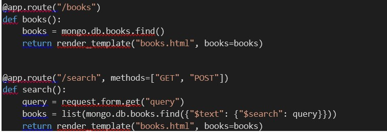
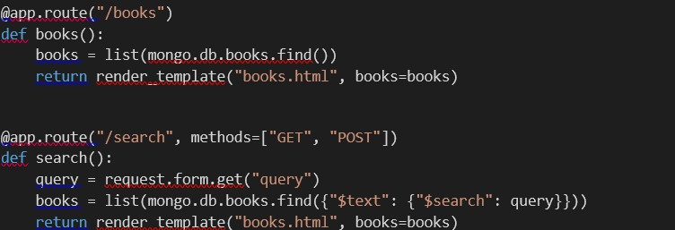
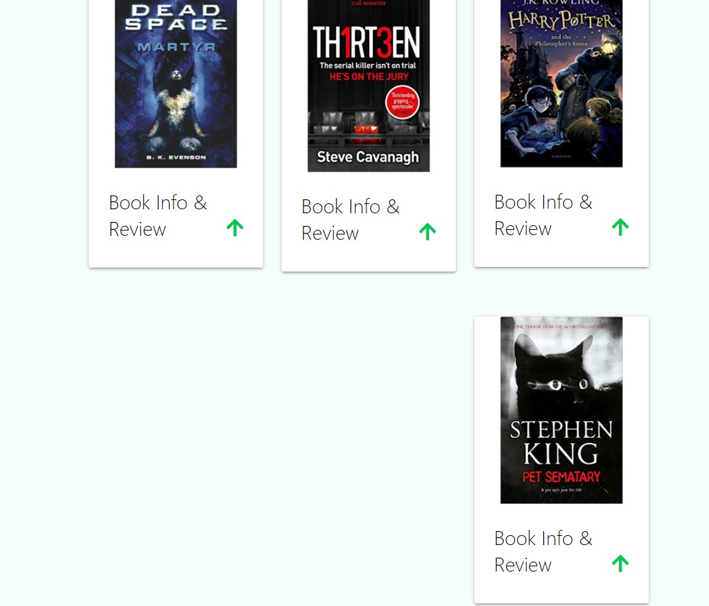
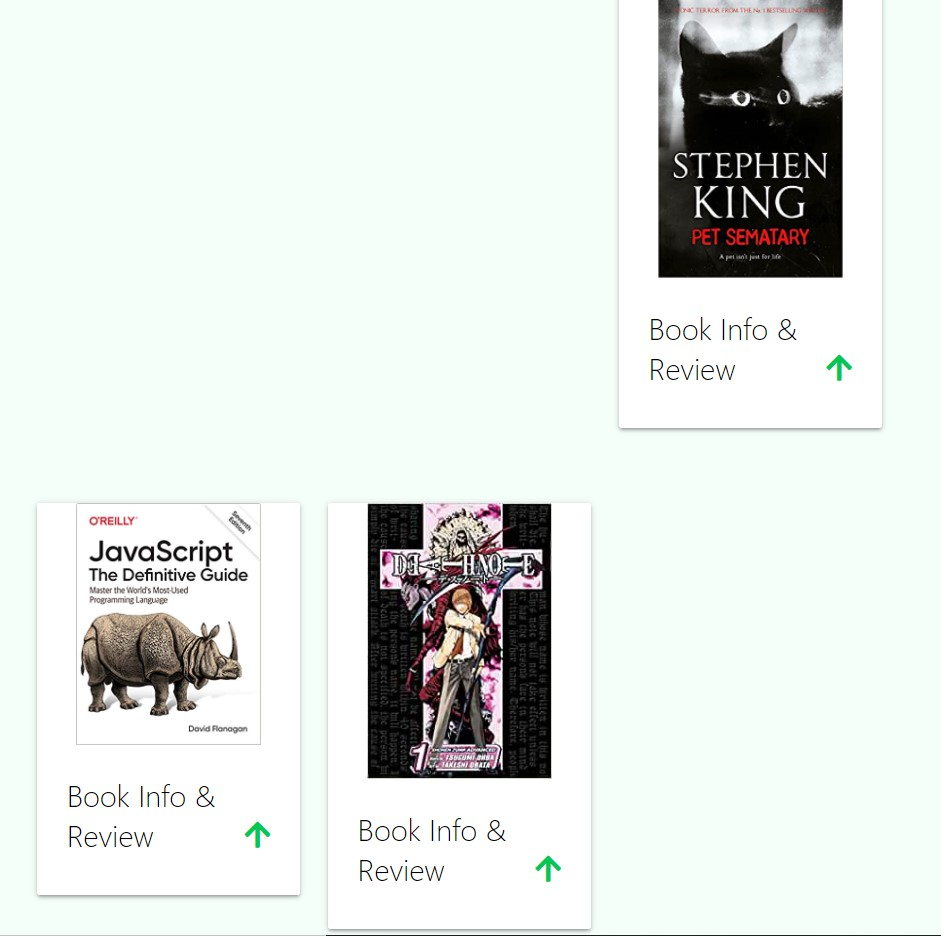

# Taylor Brookes - Milestone Project 3
## Read-It Testing Documentation

# Table Of Contents

1. [Code Validation](#code-validation)
    - [HTML5](#html5)
    - [CSS3](#css3)
    - [JS](#js)
    - [Python](#python)
2. [Features and Functionality](#features-and-functionality)
    - [Responsiveness](#responsiveness)
    - [Features (A-Z)](#features)
3. [User Stories](#user-stories)
    - [Users](#users)
    - [Site Owner/Admin](#site-owner-and-admin)
4. [Bugs and Fixes](#bugs-and-fixes)
    - [Search Bar](#search-bar-issue)
    - [Card Images](#card-images)

# Code Validation

### HTML5
[W3C HTML Validator](https://validator.w3.org/#validate_by_input) was used to check my HTML – result.

### CSS3 
[W3C CSS Validator](https://jigsaw.w3.org/css-validator/#validate_by_input) was used to make sure my CSS was compliant – result.

### JS
[JSLint](https://www.jslint.com/) was used to check my JavaScript – result.

### Python
[PEP8 Online](http://pep8online.com/) was what I used to make sure my Python Code was PEP8 compliant – result.

[Back to contents](#table-of-contents)

# Features and Functionality

### Responsiveness

-	The responsiveness of this site was tested using a Windows Laptop, an Apple MacBook Pro, a Samsung Galaxy S20 mobile phone and an iPhone 12. 

## Features
## (A-Z)

### Add Book Review

-	Form – All inputs work as intended, with requirements being displayed and inputs highlighted red if not filled in and required. 
-	Submit – Submit button correctly sends the data to the database.

### Book Review Cards

-	Hover – I added a hover effect on the book review cards so that the user can easily see which book review they are looking at, and this works well.  
-	Info & Review Icon – The Info & Review icon works as intended, sliding up the book review information over the book image.
-	Buttons – The correct buttons are displayed depending on whether the user is logged in, logged out or is the Admin of the site. 

### Bookmark Book Function

-	I had a bit of trouble when implementing this feature as I was initially not writing my code correctly to link it to the database. I looked carefully over my code and the database I was trying to connect it to, and managed to work it out so that the bookmark was saved on the database, and displayed on the ‘My Profile’ page.

### Buttons

-	Links - All buttons on the site have been tested to make sure that the direct the users to the relevant page. 
-	Hover – Most buttons have an alternative colour when hovered over, and they were all checked to make sure the correct colours were displayed when hovered over.

### Delete Book Function

-	The Delete function was tested with a number of book reviews from both the ‘Book Reviews’ page and the ‘My Profile’ page. Both pages were working as expected.

### Edit Book Review

-	Pre-fill – When a user edits a book review, the form is correctly filled in with the information they have previously entered. 
-	Buttons – Both the cancel and edit review buttons work as intended, with the edit review button correctly updating the database. 

### Flash Messages

-	All flash messages were tested across the site to make sure they popped up when they should, and that the text in the flash message is correct and not misspelt. 

### Footer

-	Links - All footer social links were tested, and correctly navigated the user to the relevant site. 
-	The footer remained at the bottom of the site regardless of amount of content, and this was tested by removing all content from the page, and re-entering it. 

### Logout

-	The logout feature works as intended and correctly logs the user out of the site. 

### Navbar

-	Links - All navbar links were thoroughly tested on both laptop and mobile views, and they all worked as intended, and directed the user to the correct page.

### Register/Log In Forms

-	Requirements – Username/Password requirements are listed below the Password input on the 'Register' page so users know when signing up what the requirements are for a new Username/Password. I have tested these features to make sure they work.
-	Username – Both forms were extensively tested to make sure that the same username could not be used more than once, and that the incorrect password could not be used to access an account that did not belong to them. 
-	Empty Fields – If a required input is left blank, it will turn red and a notification will pop up below the field, asking for the field to be filled in. 

### Search Bar

-	Search – Search function was tested by adding books and then searching for the titles and authors. All searches worked as intended. If no search results are found, the correct message is shown.
-	Clear – The clear button clears the search bar and refreshes the page. This too works as intended.

[Back to contents](#table-of-contents)

# User Stories

## User Story Testing

### Users

Easy and clear navigation throughout the entire site on all device types.
    
- The site is fully responsive regardless of device used, and the navbar is clear and easy to navigate through on both mobile and desktop/laptop devices. 

To be able to view/preview the site before registering an account.

- Users will have full access to the book reviews created before registering an account.

Have clear Registration/Log In pages.

- The registration and log in pages are clearly marked within the navbar, and are also linked on the home page, and are set as redirections for certain actions on the site if the user is not logged in.

Have the ability to add their own reviews and keep a record of them.

- Once a user has registered an account, they will easily be able to add their own book reviews. The add book review link is in the navbar so is accessible from any page in the site, as well as a link to the page on the users profile page. 

To be able to edit and delete reviews posted.

- Once a book review has been submitted, the user who created the review (as well as the admin) will be able to edit and/or delete the review easily. There are buttons that link the user (and admin) to these pages from the book review itself. 

Search the site to find other reviews.

- A search bar can be found at the top of the book review page. The user will be able to search by book title or author.

For the review information to be clear and concise.

- The review information is laid out clearly, with a heading before each bit of information that has been input, marking what information it is that they are reading. 

Keep a record of books they are interested in.

- Users will be able to bookmark books that they are interested in, and these will be saved to the users profile, and displayed on their profile page. 

Find links where they can purchase the books.

- On each book review, a button will be present with a link that will take the user to an amazon search of the book title.

To be provided with contact information and social links.

- The footer has been created with this in mind, and there is an email provided, as well as social links. 

Once finished, to securely log out of the site.

- Once a user has logged in, the log out option will be visible on the navbar. They will be able to log out at any time.

### Site Owner and Admin

For users to have easy access to all areas of the site.

- All pages have been tested for ease of access, and have been successful.

For the site to be clear and concise.

- Information throughout the site is clear and concise, and no feedback has been given whereby a user found the site difficult to navigate, or find information. 

The ability for users to contact them for any feedback/issues surrounding the site.

- An email address has been provided within the footer so that if a user wishes to contact them, they can send an email. 

To be able to add, edit and delete book reviews.

- The admin account will have access to add review, as well as edit and delete reviews that they have created and other users have created. 

Have access to an admin account whereby the owner/admin can add affiliate links to each review left by a user, and earn money from those links. (For project purposes, these links will NOT be affiliate links, and will only be links to the books on Amazon.)

- I have eliminated the need for this as the book link is auto-generated when a review is left. However, the admin will still have access to the affiliate link for if the auto-generation does not work. 

[Back to contents](#table-of-contents)

# Bugs and Fixes

## Search Bar Issue

When I added the search functionality to the site and reloaded the webpage, I got the following error;

TypeError: object of type 'Cursor' has no len()

This was my python code at the time of the error;

I was unsure how to fix this and I managed to find a fix by consulting the student slack channels. Someone else had had the same issue before me so I looked over the comments and found the fix in the comments. 
Student Abi Harrison had spoken to a course tutor and found the following fix;

The books were being returned but not as a list in def books(). I changed this by wrapping mongo.db.books.find() in list(). This rectified the issue, and the fixed code is below.

## Card Images

When I originally made my cards for the book reviews, I had not set the size of the book image. This meant that when an image was smaller/larger than the one next to it, it created an issue with gaps below the cards. 

I struggled with how to get the images the same size, and consulted the slack community. Naoise Gaffney helped to provide me with a solution, and with his help, I was able to get the card size the same regardless of image size. This fix is what I am using for my site. 

[Back to contents](#table-of-contents)